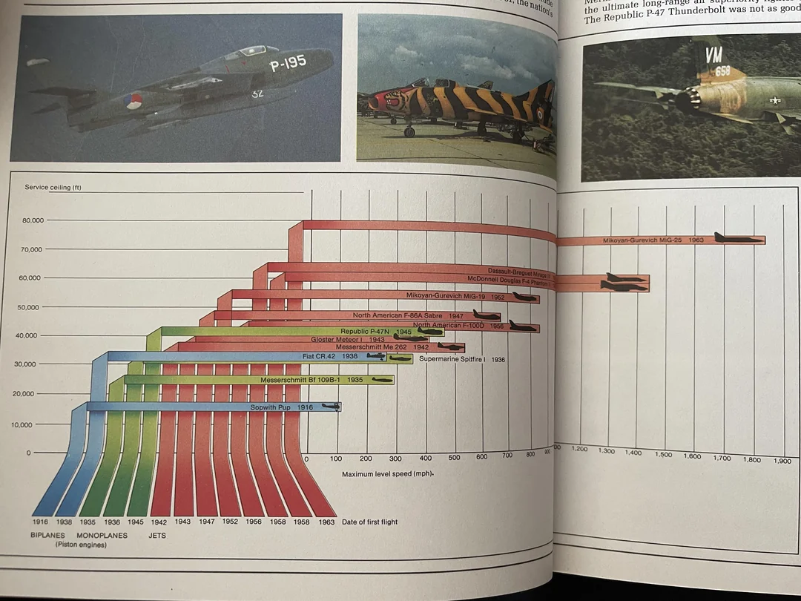

```{r setup, include=FALSE}
# Custom Options
options(timeout=2000) # I have Really Really bad Internet, Damn You Telstra and Opticomm
options(repos=c(CRAN="https://cran.csiro.au/")) # For stability I set a mirror, if you have a preferred one, comment out line
knitr::opts_chunk$set(warning = FALSE, message = FALSE) # Turn Off Messages and Warnings

# Install Libraries (Only if they are not already installed)
if (!require("drat")) install.packages("drat")
if (!require("ggplot2")) install.packages("ggplot2")
if (!require("tidyverse")) install.packages("tidyverse")
if (!require("formatR")) install.packages("formatR")
if (!require("formatR")) install.packages("formatR")
if (!require("tidytuesdayR")) install.packages("tidytuesdayR")
if (!require("reshape2")) install.packages("reshape2")
if (!require("ggiraphExtra")) install.packages("ggiraphExtra")
if (!require("igraph")) install.packages("igraph")
if (!require("network")) install.packages("network")
if (!require("sna")) install.packages("sna")
if (!require("ndtv")) install.packages("ndtv")
if (!require("EpiContactTrace")) install.packages("EpiContactTrace")
if (!require("RColorBrewer")) install.packages("RColorBrewer")
if (!require("viridis")) install.packages("viridis")
if (!require("circlize")) install.packages("circlize")
if (!require("alluvial")) install.packages("alluvial")
if (!require("ggrepel")) install.packages("ggrepel")
if (!require("ggsankeyfier")) install.packages("ggsankeyfier")
if (!require("rnaturalearth")) install.packages("rnaturalearth")
if (!require("rnaturalearthdata")) install.packages("rnaturalearthdata")
if (!require("ggspatial")) install.packages("ggspatial")
if (!require("maps")) install.packages("maps")
if (!require("sf")) install.packages("sf")
if (!require("cartogram")) install.packages("cartogram")
if (!require("sp")) install.packages("sp")
if (!require("spData")) install.packages("spData")
if (!require("raster")) install.packages("raster")
if (!require("patchwork")) install.packages("patchwork")

# Load Libraries
library(drat)
library(ggplot2)
library(tidyverse)
library(dplyr)
library(magrittr)
library(formatR)
library(tidytuesdayR)
library(reshape2)
library(ggalluvial)
library(ggiraphExtra)
library(igraph)
library(network)
library(sna)
library(ndtv)
library(EpiContactTrace)
library(RColorBrewer)
library(viridis)
library(circlize)
library(alluvial)
library(ggrepel)
library(ggsankeyfier)
library(rnaturalearth)
library(rnaturalearthdata)
library(ggspatial)
library(sf)
library(maps)
library(cartogram)
library(sp)
library(spData)
library(raster)
library(terra)
library(patchwork)

# Add Extra Data Repo's
drat::addRepo("kjhealy")
drat::addRepo("doehm")

# Install Extra data packages
if (!require("covdata")) install.packages("covdata")
if (!require("survivoR")) install.packages("survivoR")

# Extra Data 
# **!! DO NOT MUTATE THIS DATA !!**
# This data is like this to stop repeated download as Github Rate limited me. DAMN YOU GITHUB
# Thus if this data is mutated it will stay mutated and not get refreshed
# To fix mutated data clear the data and re-run 
if(!exists("gender_pay_gap_data")) {
  gender_pay_gap_data <- read.csv("https://raw.githubusercontent.com/plotly/datasets/master/school_earnings.csv")
}
if(!exists("people_migration_data")) people_migration_data <- read.table("https://raw.githubusercontent.com/holtzy/data_to_viz/master/Example_dataset/13_AdjacencyDirectedWeighted.csv", header=TRUE)
if(!exists("tuesdata")) tuesdata <- tidytuesdayR::tt_load(2021, week = 15)
```

\pagebreak

## Q1 - Week 3

**Image: [Service Ceiling and Maximum Level Speed of different aircraft](https://www.reddit.com/r/dataisbeautiful/comments/1cx70t7/found_thihttps://www.reddit.com/r/dataisbeautiful/comments/1cx70t7/found_this_beautiful_graph_showing_service/s_beautiful_graph_showing_service/):**

[](https://www.reddit.com/r/dataisbeautiful/comments/1cx70t7/found_this_beautiful_graph_showing_service/)

### A. Describing the context

**Who is the audience or audiences?:**

The audience for the graph in the photo is likely people who are interested in the history of fighter jets. The graph compares the service ceiling and maximum level speed of various fighter jets throughout history. This information would be of interest to aviation enthusiasts, military history buffs, or anyone who is curious about how fighter jet technology has advanced over time.

**What is the action the visualisation is aiming for? Consider each audience here:**

1.  **Understanding:** The graph wants to show the audience how fighter jet capabilities (service ceiling and speed) have progressed throughout history. By visualizing this trend, it allows viewers to grasp the significant advancements made in fighter jet technology.
2.  **Comparison:** The graph allows viewers to compare the capabilities of different fighter jets across eras. This helps understand the jump in performance between generations of jets.

**When can the communication happen, and what tools have been used to suggest an order:**

All information is provided in a still image and, the Graphs focus on data presentation. They primarily showcase information visually. While order can be implied through the placement of elements (e.g., chronological order on the x-axis), the focus isn't on dictating a specific sequence of communication steps.

**How has the data been used to convey the action?:**

The data in the fighter jet graph has been used to convey the action through several key techniques:

-   **Comparison**: The graph uses two separate data points - service ceiling and maximum level speed - to showcase fighter jet capabilities across eras. This allows viewers to directly compare how these performance metrics have improved over time.

-   **Trends**: By plotting the data points on a vertical axes for service ceiling and horizontal axis representing time and speed, the graph creates a visual trend. This upward trend clearly shows the overall progress in fighter jet technology.

-   **Visual Hierarchy**: The graph uses elements like colour to differentiate between eras of fighter jets. This visual hierarchy helps viewers distinguish between different jet generations and their corresponding capabilities.

-   **Clarity**: The graph uses clear labels for axes, data points. This clarity ensures viewers can understand what each data point represents and how to interpret the information.

### B. Genre

**Which of the seven genres listed above best describes the data visualisation?**

Magazine style. Would work as a figure in an article or report that is referred to in writing.

### C. Author-driven vs Reader-driven

**Where on the spectrum from author to reader-driven is this visualisation?** This visualisation leans more towards the author-driven end of the spectrum, though it incorporates some elements that could facilitate reader-driven exploration. Here are the characteristics that indicate its position on the spectrum:

Author-Driven Aspects:

-   **Structured Presentation:** The visualization is highly structured, presenting information in a clear and linear format. The progression of aircraft over time is well-organised, showing the development of service ceilings and speeds.

-   **Pre-Selected Data:** The data shown (aircraft types, service ceilings, speeds, and dates of first flight) is pre-selected by the author. This curation means the reader is presented with a specific narrative and set of data points.

-   **Annotations and Images:** The inclusion of specific images and annotations (such as aircraft names and years) directs the reader’s attention and supports the intended narrative.

-   **No Interactive Elements:** Since this is a static visualisation from a printed source, there are no interactive elements for the reader to manipulate or explore additional data.

\pagebreak

## Q2 - Week 3

### What is the main argument of the paper?

The main argument of "Raoufi et al. 2019" focuses on the challenges related to visualising quantitative sustainability performance data, particularly for non-expert decision-makers. The paper describes a gap between the intent to improve environmental impacts and the actual implementation of sustainability practices, due to difficulties in interpreting complex life cycle assessment (LCA) data. It emphasises the need for effective visualisation techniques to make sustainability performance data more accessible and understandable to improve a readers decision-making processes.

### According to this paper, why is effective visual communication important?

According to Raoufi et al. (2019), effective visual communication is crucial for several reasons:

-   **Facilitates Decision Making**: It helps non-experts, such as students and marketing professionals, understand complex sustainability data, leading to better decisions.
-   **Clarifies Uncertainty**: Proper visualisation conveys data uncertainties, preventing false confidence and aiding in decisions.
-   **Bridges Research and Practice**: Effective visuals bridge the gap between academic research and industry practice, making research outcomes useful and applicable.
-   **Enhances Education**: Visual techniques educate non-experts on sustainability metrics, helping them interpret data correctly and make informed decisions.

Effective visual communication makes sustainability performance data accessible, understandable, and actionable, improving decision-making and fostering better sustainability practices.

### What are the key elements, considerations, or factors to be considered for effective visual communication addressed in the paper? Do you disagree with any?

Raoufi et al. (2019) identify key factors for effective visual communication:

-   **Understanding Audience Characteristics**: Tailoring visuals to meet audience needs.
-   **Providing Familiar Context**: Using well-accepted formats to avoid confusion.
-   **Clearly Representing Uncertainty**: Making uncertainties clear to avoid false confidence.
-   **Developing Educational Approaches**: Creating methods to educate non-experts on sustainability metrics.
-   **Creating New Visualisation Techniques**: Simplifying complex data to improve decision-making.
-   **Considering UI/UX Factors**: Designing user-friendly interfaces.

The paper advises against traditional formats like tables and bar charts in favour of more intuitive visualisations. Overall, the goal is to make sustainability data accessible and actionable, facilitating informed decisions and better sustainability practices.

### What pitfalls are identified in the paper that can be avoided if we use effective visual communication?

Effective visual communication avoids several pitfalls:

-   **Misinterpretation of Uncertainty**: Traditional methods often fail to convey uncertainties accurately.
-   **Difficulty in Rapid Data Interpretation**: Non-intuitive visuals can delay decision-making.
-   **Lack of Contextual Relevance**: Visuals without familiar contexts can confuse users.
-   **Poor Audience Engagement**: Ineffective communication reduces engagement and data usage.

Addressing these pitfalls enhances the interpretability and usability of sustainability data, leading to better-informed decisions and practices.

\pagebreak

## Q3 - Week 4

```{r  echo=TRUE}
ggplot(USArrests, aes(x = UrbanPop)) + 
  geom_point(aes(y = Assault, color = "Assault")) + 
  geom_smooth(formula = 'y ~ x', linetype="dashed", method = "lm", se=FALSE, 
              aes(y = Assault, color = "Assault")) +
  geom_point(aes(y = Rape, color = "Rape")) + 
  geom_smooth(formula = 'y ~ x', linetype="dashed", method = "lm", se=FALSE, 
              aes(y = Rape, color = "Rape")) +
  geom_point(aes(y = Murder, color = "Murder")) + 
  geom_smooth(formula = 'y ~ x', linetype="dashed", method = "lm", se=FALSE, 
              aes(y = Murder, color = "Murder")) +
  theme(plot.title = element_text(hjust = 0.5)) +
  labs(x="Percent Urban Population", y="Per 100,000 People", 
       title = "Population to Crime", color = "Crime")

```

A scatter plot is used because it is effective in showing the relationship between two continuous variables. In this case, it displays the correlation between the percentage of the urban population and the crime rate for different types of crimes. Scatter plots are particularly useful for identifying patterns, trends, and potential outliers in the data.

These aesthetic choices collectively enhance the figure's ability to communicate the data effectively. The use of distinct colours for different crimes ensures that each category is easily distinguishable. The inclusion of trend lines helps viewers quickly grasp the overall trend and correlation. Gridlines and clear axis labels improve the readability and interpretation of the plot. The placement of the legend and the descriptive title ensure that the plot is self-explanatory and easy to understand, making the figure a powerful tool for conveying the relationship between urbanization and crime rates.

\pagebreak

## Q4 - Week 4

```{r echo=TRUE}

# Filter data
aus_apple_subset <- apple_mobility %>%
  filter(country == c('Australia'), transportation_type == 'driving')

us_apple_subset <- apple_mobility %>%
  filter(country == c('United States'), transportation_type == 'driving')

uk_apple_subset <- apple_mobility %>%
  filter(country == c('United Kingdom'), transportation_type == 'driving')

# Clean data (remove NA)
aus_apple_subset <- aus_apple_subset[complete.cases(aus_apple_subset[ , 7:8]),]
us_apple_subset <- us_apple_subset[complete.cases(us_apple_subset[ , 7:8]),]
uk_apple_subset <- uk_apple_subset[complete.cases(uk_apple_subset[ , 7:8]),]

# Group data in 2 day chunks to make viewing easier
aus_apple_subset <- aus_apple_subset %>%
  group_by(date = lubridate::floor_date(date, "2 day")) %>%
  summarise(mean_score = mean(score))

us_apple_subset <- us_apple_subset %>%
  group_by(date = lubridate::floor_date(date, "2 day")) %>%
  summarise(mean_score = mean(score))

uk_apple_subset <- uk_apple_subset %>%
  group_by(date = lubridate::floor_date(date, "2 day")) %>%
  summarise(mean_score = mean(score))


# Plot data with trend lines
ggplot() + 
  geom_line(aus_apple_subset, 
            mapping = aes(x = date, y = mean_score, 
                          color = "Australia")) + 
  geom_smooth(aus_apple_subset, formula = 'y ~ x', 
              linetype="dashed", method = "lm", se=FALSE, 
              mapping = aes(x = date, y = mean_score, 
                            color = "Australia")) + 
  geom_line(us_apple_subset, 
            mapping = aes(x = date, y = mean_score, 
                          color = "United States")) +
  geom_smooth(us_apple_subset, formula = 'y ~ x', 
              linetype="dashed", method = "lm", se=FALSE, 
              mapping = aes(x = date, y = mean_score, 
                            color = "United States")) + 
  geom_line(uk_apple_subset, 
            mapping = aes(x = date, y = mean_score, 
                          color = "United Kingdom")) +
  geom_smooth(uk_apple_subset, formula = 'y ~ x', 
              linetype="dashed", method = "lm", se=FALSE, 
              mapping = aes(x = date, y = mean_score, 
                            color = "United Kingdom")) + 
  theme(plot.title = element_text(hjust = 0.5)) +
  labs(x = "Time", y = "Double Activity Score", 
       title = "Driving over Time in Diffrent Countries", 
       color = "Countries")
```

#### Justification for Plot Type and Variables

The choice of a line plot is appropriate for this dataset as it effectively displays the trend of driving activity over time for different countries. Line plots are particularly useful for time series data, allowing viewers to observe changes and trends across different time points.

Variables:

-   **Time (X-Axis):** Time is plotted on the X-axis, which is a standard practice for time series data. It provides a chronological context that helps in understanding the progression and patterns over time.

-   **Double Activity Score (Y-Axis):** The Double Activity Score is plotted on the Y-axis, representing the magnitude of driving activity. This variable is key to understanding the variations and trends in driving behaviour across different countries.

#### Aesthetic Choices:

Colours:

-   **Distinct Colours for Each Country:** Using distinct colours (red for Australia, green for the United Kingdom, and blue for the United States) makes it easy to differentiate between the countries. This is crucial for comparing trends across the different datasets.

-   **Legend Placement:** The legend is placed on the right side of the plot, which keeps the main graph area uncluttered and ensures that the viewer can easily match each line to its corresponding country.

Line Styles:

-   **Solid Lines:** Solid lines are used for the actual data points, which provides a clear and continuous representation of the data.

-   **Dashed Trend Lines:** The dashed trend lines provide an additional layer of information by indicating the overall trend, making it easier to observe the general direction (increasing or decreasing) of the activity scores over time.

Title and Labels:

-   Title: The title "Driving over Time in Different Countries" clearly indicates the subject of the plot, providing context at a glance.

-   Axis Labels: The X-axis label "Time" and the Y-axis label "Double Activity Score" provide clear information about the variables being represented, ensuring that the viewer understands what each axis represents.

Grid:

-   **Grid Lines:** The inclusion of grid lines helps in reading the values more accurately by providing a reference framework against which the data points can be compared.

#### Effectiveness:

These aesthetic choices enhance the figure's effectiveness by:

-   **Clarity:** Differentiating countries with distinct colours and line styles ensures that the viewer can easily follow each country's trend without confusion.

-   **Trend Visibility:** Dashed trend lines provide an easy way to observe the general direction of changes over time.

-   **Readability:** Clear labelling and the use of grid lines make the plot easy to read and interpret, even for viewers who may not be familiar with the specific data.

Overall, these choices make the plot an effective communication tool by ensuring clarity, ease of comparison, and readability.

\pagebreak

## Q5 - Week 4

Plot 1

```{r echo=TRUE}
ggplot(InsectSprays, aes(x = spray, y = count)) + 
  geom_boxplot() + geom_jitter() +
  theme(plot.title = element_text(hjust = 0.5)) +
  labs(x = "Spary", y = "Dead Insect Count", 
       title = "Effectiveness of Insect Sparys")

```

\pagebreak

Plot 2

```{r echo=TRUE}
ggplot(InsectSprays, aes(x = spray, y = count)) + 
  geom_col() +
  theme(plot.title = element_text(hjust = 0.5)) +
  labs(x = "Spary", y = "Dead Insect Count", 
       title = "Effectiveness of Insect Sparys")
```

The choice to use both a box plot and a column plot is based on their distinct ways of presenting data. The box plot provides detailed information, including the first and third quartiles, median, and the smallest and largest values within 1.5 \* IQR of the hinges, making it an effective tool for viewers who need a deeper statistical understanding. On the other hand, the column plot offers a concise summary of the data, making it ideal for viewers who prefer a straightforward overview of the effectiveness of each spray without delving into individual data points.

\pagebreak

## Q6 - Week 6

### Graph 1

```{r echo=TRUE}
ggplot(gender_pay_gap_data, aes(y=Men, x=Women, color=School)) +
  geom_point(alpha=0.5) +
  theme(plot.title = element_text(hjust = 0.5)) +
  labs(x = "Women Annual Pay", y = "Men Annual Pay", 
       title = "Pay of Men and Women from diffrent Schools")
```

### Graph 2

```{r echo=TRUE}
ggplot(gender_pay_gap_data, aes(y=Men, x=Women, color=School, size=Gap)) +
  geom_point(alpha=0.5) +
  theme(plot.title = element_text(hjust = 0.5)) +
  labs(x = "Women Annual Pay", y = "Men Annual Pay", 
       size = "Annual Pay Gap",
       title = "Pay Gap of Men and Women from diffrent Schools") +
  xlim(60, 170) + 
  ylim(60, 170)
```

### 1) What do you think is the first observation a reader makes from the second plot?

When looking at the graph the first thing that jumps out is how quickly the trend of the schools increases in the Men's favour, the trend lines ***gradient*** has a almost slop of 2.

### 2) Why have you chosen to match the variable with the preattentive attributes you have chosen in the first plot?

Adding the pay gap as the size of each circle gives a quick visual indication of how large the pay gap is for men and women, without looking at the axis numbers you can quickly find the pay gap size. Having the data presented in this way has many benefits, allows for quick view of pay gap with size but having each one plotted allows for the ability to make correlation between the data point that would otherwise not be able to be made easily.

### 3) What audience might you use your first plot for vs your second?

As the second plot allows *Quicker* viewing experience id say its more suited for a magazine or some where that is more casual, where as in the first plot the pay gap can still be determined as the data is still plotted but this allows for a more accurate view as seeing where the centre is for all points is easier to do without different sizes.

\pagebreak

## Q7 - Week 6

```{r echo=TRUE}
ggplot(CO2, aes(y=uptake, x= as.character(conc), group = as.character(conc))) + 
  geom_boxplot() + facet_grid(Type ~ Treatment) +
  theme(plot.title = element_text(hjust = 0.5)) +
  labs(x = "Ambient CO2 Concentrations (mL/L)", 
       y = ~paste("Uptake (", mu, "mol/m"^2,"sec)"),
       title = "Carbon Dioxide Uptake in Grass Plants")
```

#### Justification for Plot Type

Box plots are ideal for displaying the distribution of data points and identifying central tendencies, variability, and potential outliers. This is particularly useful when comparing multiple groups, as it allows for a clear visual comparison of medians, quartiles, and ranges.

#### Aesthetic Choices

-   **Box Plot Elements:** The box plots include median lines, interquartile ranges (IQR), whiskers, and potential outliers, which provide a comprehensive summary of the data distribution.

-   **Faceting:** The use of faceting (Quebec vs. Mississippi and non-chilled vs. chilled) helps in segregating the data in a way that makes comparisons more straightforward and the plot less cluttered.

-   **Grid Layout:** The grid layout makes it easier to compare multiple variables at once without overwhelming the viewer with too much information on a single plot.

-   **Consistent Scales:** Using consistent scales across the plots ensures that comparisons are meaningful and not distorted by different axis ranges.

-   **Clear Labels:** The labels on the axes and panels are clear and descriptive, making it easier for the audience to understand what each axis and panel represents without additional explanation.

### Effectiveness of the Communication Tool

The figure effectively communicates the following:

-   **Comparative Analysis**: By separating data into different panels and facets, it allows for an easy comparison between different conditions (e.g., geographic regions, temperature treatments).

-   **Data Distribution**: The use of box plots clearly shows the distribution of data, including medians, quartiles, and outliers, which provides a full picture of the data set.

-   **Highlighting Key Findings**: The simplicity and clarity of the design ensure that key findings and trends are easily noticeable without being obscured by overly complex visuals.

\pagebreak

## Q8 - Week 6

```{r echo=TRUE}
data <- melt(tuesdata$brazil_loss, id.vars = c("year", "entity", "code")) %>% 
  mutate(variable = gsub("_", " ", variable))
ggplot(data, aes(x=year, y=variable, fill=value)) + 
  geom_tile() +   
  theme(plot.title = element_text(hjust = 0.5)) +
  labs(x = "Year", y = "Cause",
                       fill = "Forest Area Lost",
                       title = "Land Area Lost over time in Brizil to diffrent Cause")
```

### 1) What do you think is the first observation a reader makes from the plot?

The first observation would be the "Pasture" row, as this is the brightest row. This row shows that the forest lost to pasture is significant and far above all other Cause. This also shows that in recent years the forest lost to pasture is decreasing.

### 2) Why/Why not is your chosen plot type an effective way to visualise this data to make this comparison?

This plot is effective in displaying a summery of data in a readable format to the user, but this lacks fine detailed information and extra information some other plot types may offer.

### 3) What is another visualisation option (you do not need to make this plot)?

An alluvial plot would have showed this data better as that would have finer detail that is lost in this type of plot.

\pagebreak

## Q9 - Week 6

```{r echo=TRUE}
ggRadar(tuesdata$brazil_loss %>% filter(year %in% c("2002", "2007", "2013")), 
        aes(x = c(pasture, fire, natural_disturbances, 
                  flooding_due_to_dams, selective_logging, mining, 
                  commercial_crops), 
            group = year), 
        rescale = TRUE, 
        size = 1) +
  scale_color_manual(values = c("blue", "green", "red")) +
  scale_fill_manual(values = c("blue", "green", "red")) +
  theme_bw() +
  scale_y_discrete(breaks = NULL) +
  theme(plot.title = element_text(hjust = 0.5)) +
  labs(x =  "Forest Area Lost",
       title = "Forest Area Lost over in 3 diffrent years to diffrent Cause in Brizil")

```

### 1) What do you think is the first observation a reader makes from the plot?

The first observation a reader would likely make is the fact that the areas of the graph (blue, green red), don't overlap much. This shows that each year there is new main Cause's for the Lost Forest

### 2) Why/Why not is your chosen plot type an effective way to visualise this data to make this comparison?

This plot type works ok for showing the data and gives the contrast on the data points compared to the above plot, but the data set is a a collection of 13 years, and with the plot type, all this data cant be shown at once and 3 years must be selected at a time.

### 3) What is another visualisation option (you do not need to make this plot)?

To be able to show all the years on a a single plot a heat map would work well. A cumulative line graph with fill would be a very good option as all data could be shown and the data can be shown in more detail too.

\pagebreak

## Q10 - Week 7

Graph 1

```{r echo=TRUE}
people_migration_data_temp <- people_migration_data 
colnames(people_migration_data_temp) <- c("Africa", "EAsia", "Europe", "LatinAm.",   "NorthAm.",   "Oceania", "SAsia", "SEAsia", "Sov.Un.", "WAsia")
rownames(people_migration_data_temp) <- colnames(people_migration_data_temp)
data_long <- gather(rownames_to_column(people_migration_data_temp), key='key', value='value', -rowname)
mycolor <- viridis(nrow(people_migration_data_temp))
chordDiagram(
  x = data_long, 
  grid.col = mycolor,
  transparency = 0.25,
  directional = 1,
  direction.type = c("arrows", "diffHeight"),
  diffHeight  = -0.04,
  link.arr.type = "big.arrow",
  link.sort = TRUE)
```

Graph 2

```{r echo=TRUE}
people_migration_data_temp <- people_migration_data 
colnames(people_migration_data_temp) <- c("Africa", "East Asia", "Europe", "Latin America",   "North America.",   "Oceania", "South Asia", "South East Asia", "Soviet Union", "West Asia")
rownames(people_migration_data_temp) <- colnames(people_migration_data_temp)
data_long <- gather(rownames_to_column(people_migration_data_temp), key='key', value='value', -rowname)
mycolor <- viridis(nrow(people_migration_data_temp))


ggplot(data_long, aes(y = value, axis1 = rowname, axis2 = key)) +
  geom_alluvium(aes(fill = key), width = 1/12, curve_type = "quintic") +
  geom_stratum(width = 1/12, color = "black", fill = NA,) +
  scale_x_discrete(limits = c("Start Geographic Area", "End Geographic Area"), expand = c(.05, .05)) +
  theme(plot.title = element_text(hjust = 0.5)) +
  ggrepel::geom_text_repel(
    aes(label = ifelse(after_stat(x) == 1, as.character(after_stat(stratum)), "")),
    stat = "stratum", size = 4, direction = "y", nudge_x = -.5) +
  ggrepel::geom_text_repel(
    aes(label = ifelse(after_stat(x)  == 2, as.character(after_stat(stratum)), "")),
    stat = "stratum", size = 0, nudge_x = 0
  ) +
  labs(y = "Number Of People",
       fill = "Geographic Areas",
       title = "Migrating Of People From One Geographic Area to Each Other")
```

#### 2) In 1-2 sentences, propose any differences in the who/what/when context between these two visualisations.

The key difference in context between these visualisations lies in their emphasis and clarity of migration flows. The Alluvial plot (second image) clearly indicates the start and end geographic areas, showing the magnitude and direction of migrations in a linear, sequential manner. In contrast, the chord diagram (first image) focuses on the interconnectedness and volume of migrations between regions, presenting a more complex and intertwined view of migration patterns without a clear linear start and end.

#### 3) How have your aesthetic choices improved an audiences’ understanding of the visualisation, and helped to communicate within this context?

The aesthetic choices in the Alluvial plot (second image) improve the audience's understanding by providing a clear, linear flow from the start to the end geographic areas. This layout makes it easier to trace individual migration paths and understand the direction and magnitude of migrations between specific regions. The use of distinct colours for different geographic areas and the separation of flows helps in distinguishing between various migration routes.

In contrast, the chord diagram (first image), while visually striking, presents a more complex and intertwined representation of migration flows. The circular format can make it challenging to follow specific migration paths and compare the volume of migration between regions.

Overall, the Alluvial plot's linear and structured format with clear start and end points enhances clarity and communication of migration data, making it more accessible and easier to interpret for the audience.

#### 4) Describe a different visualisation that can communicate the same message with the same variables in the data. How might this other visualisation be more effective than this alluvial visualisation?

A different visualisation that can communicate the same message using the same variables is a **Geographic Heatmap** overlaid on a world map.

### Description:

1.  **Geographic Heatmap:**
    -   **Base Layer:** Use a world map as the base layer.
    -   **Heatmap Layer:** Overlay a heatmap that shows migration intensity between regions.
    -   **Arrows/Lines:** Use directional arrows or lines to indicate migration paths between regions. The thickness of the arrows can represent the number of people migrating.
    -   **Colour Coding:** Use colour gradients to indicate the volume of migration (e.g., light colours for lower volumes, darker colours for higher volumes).

### How It Might Be More Effective:

1.  **Spatial Context:**
    -   By using a world map, the visualisation leverage's the audience's familiarity with geographic locations, making it easier to relate the data to real-world regions.
    -   The spatial context helps in understanding the physical distance and direction of migration flows.
2.  **Clarity and Intuition:**
    -   The use of arrows/lines directly connecting regions simplifies the understanding of migration paths compared to the intertwined lines of a Sankey diagram.
    -   The heatmap aspect visually emphasizes regions with higher migration volumes, quickly drawing attention to key areas.
3.  **Detailed Insights:**
    -   An interactive version of the heatmap could allow users to hover over regions or arrows to see detailed statistics, providing deeper insights without cluttering the visualisation.
    -   This can also include time-based sliders to observe changes in migration patterns over different periods.
4.  **Comprehensive Comparison:**
    -   By displaying all regions on a single map, it is easier to compare migration volumes and patterns across different areas simultaneously.
    -   The visual contrast between regions and the movement lines make disparities and significant trends more apparent.

This Geographic Heatmap approach combines the geographical accuracy of a world map with the visual appeal and informative nature of a heatmap, potentially offering a more intuitive and contextually rich understanding of migration patterns than the linear flow of a Alluvial plot.

#### 5) Describe (but do not implement) a different visualisation that can communicate the same message, which includes additional information/data that can expand the message. You do not need to find this data, but please describe it. How might this other visualisation be more or less effective than this alluvial visualisation?

A different visualisation that can communicate the same message and include additional information is a **Geospatial Network Graph with Demographic Data**.

### Description:

1.  **Geospatial Network Graph:**
    -   **Base Layer:** Use a world map as the base layer.
    -   **Nodes:** Represent regions as nodes placed geographically on the map.
    -   **Edges:** Use lines or arcs between nodes to represent migration paths. The thickness and colour of the edges can indicate the volume and direction of migration.
    -   **Node Size/Colour:** Vary the size and colour of the nodes based on additional demographic data such as population size, GDP, or unemployment rate.
2.  **Additional Information/Data:**
    -   **Population Size:** Show the population size of each region with the size of the nodes.
    -   **Economic Indicators:** Use colour gradients on the nodes to represent economic indicators like GDP per capita or unemployment rates.
    -   **Migration Motives:** Include information on the reasons for migration (e.g., economic, political, environmental) with different edge styles (dashed, dotted, solid).
    -   **Unemployment Rate:** Percentage of the labour force that is unemployed in each region.

### Effectiveness Compared to the Alluvial plot:

1.  **Advantages:**
    -   **Comprehensive View:** Combines migration data with additional demographic and economic information, offering a holistic view of migration patterns and their potential drivers.
    -   **Geographic Context:** Retains the spatial context of the world map, making it easy to relate migration data to real-world locations and distances.
    -   **Insightful Comparisons:** Allows for comparisons not only of migration volumes but also of regional attributes like economic status and population size, providing deeper insights into migration dynamics.
    -   **Interactivity:** An interactive version can allow users to click on nodes or edges to see detailed information about migration statistics, demographic data, and economic conditions.
2.  **Disadvantages:**
    -   **Complexity:** The addition of multiple layers of information can make the visualisation more complex and harder to interpret at a glance compared to the more straightforward Alluvial plot.
    -   **Clutter:** With many nodes and edges, the graph can become cluttered, especially in regions with high migration volumes or many contributing factors.
    -   **Overload of Information:** Users might find it overwhelming to process multiple types of data simultaneously, reducing the clarity of the main message about migration flows.

### Conclusion:

A Geospatial Network Graph with Demographic Data can be more effective than a Alluvial plot by providing a richer, multidimensional view of migration patterns and their underlying factors. However, it may also be less effective due to its increased complexity and potential for information overload. The choice of visualisation depends on the audience's ability to process complex information and the need for a detailed versus a clear, high-level overview.

\pagebreak

## Q11 - Week 7

```{r echo=TRUE}
attr1 <- read.csv("data/Farms/attr_farms.csv", stringsAsFactors = F)
edges <- read.csv("data/Farms/Edgelist_farms.csv", stringsAsFactors = F)

net_edges <- graph.data.frame(edges,directed=T)

V(net_edges)$type <- as.character(attr1$type[match(V(net_edges)$name,attr1$farm.id)])
V(net_edges)$farm.size <- attr1$size[match(V(net_edges)$name,attr1$farm.id)]


e2 <- edges %>% 
  filter('batch.size' > 50 ) 

net.c <- graph.data.frame(e2)

V(net.c)$farm.size <- (attr1$size[match(V(net.c)$name,attr1$farm.id)])

V(net.c)$type <- as.character(attr1$type[match(V(net.c)$name,attr1$farm.id)] )

V(net.c)$color <- V(net.c)$type

V(net.c)$color <- gsub("Breeding","navy",V(net.c)$color)
V(net.c)$color <- gsub("Complete cycle","magenta2",V(net.c)$color)
V(net.c)$color <- gsub("Growing","green4",V(net.c)$color)
V(net.c)$color <- gsub("Fattening","steelblue1",V(net.c)$color)
V(net.c)$color <- gsub("Dairy","darkgoldenrod1",V(net.c)$color)
V(net.c)$color <- gsub("Small farm","mediumpurple",V(net.c)$color)

plot.igraph(simplify(net.c),
            layout=layout.fruchterman.reingold,
            vertex.label=NA,
            vertex.color=V(net.c)$color,
            # vertex.size=log10(V(net.c)$farm.size) * 3,
            vertex.size=V(net.c)$farm.size/150,
            edge.arrow.size=.3)

legend("bottomleft",
       legend=c("Breeding","Growing","Complete cycle","Fattening","Dairy","Small farm"),
       col=c("navy","green4","magenta2","steelblue1","darkgoldenrod1","mediumpurple"),
       pch=19,cex=1,bty="n") 
title("Cattle Movement")
```

#### 1) Do you notice any patterns about where large farms are located within the network?

The main "large" farms are mostly Dairy Farms.

#### 2) Describe the message being communicated with this visualisation, and who the audience is.

The visualisation communicates the movement and network of cattle between different types of farms. Here are the key points:

1.  **Farm Types**: The nodes (circles) represent different types of farms involved in cattle production, such as breeding, growing, complete cycle, fattening, dairy, and small farms. Each type is colour-coded for easy identification.

2.  **Cattle Movement**: The lines (edges) connecting the nodes indicate the movement of cattle between these farms. The direction of the arrows shows the flow of cattle from one farm to another.

3.  **Farm Size and Connectivity**: The size of the nodes indicates the relative size or importance of the farms within the network. Larger nodes represent larger or more central farms that have more connections to other farms.

4.  **Network Structure**: The visualisation highlights the structure of the network, showing clusters of interconnected farms. It indicates which types of farms are central to the network and how different farm types interact.

### **Intended Audience**

The audience for this visualisation likely includes:

1.  **Agricultural Researchers**: To study the patterns and dynamics of cattle movement and farm interactions.

2.  **Farmers and Farm Managers**: To understand their position within the broader network and identify potential partnerships or areas for improvement.

3.  **Policy Makers and Regulators**: To monitor and regulate cattle movement for health, safety, and economic purposes, and to design policies that enhance the efficiency and sustainability of the cattle industry.

4.  **Supply Chain Analysts**: To optimize the supply chain by understanding how cattle move through different stages of production.

Overall, the visualisation provides insights into the cattle movement ecosystem, helping various stakeholders make informed decisions.

#### 3) How have your aesthetic choices improved an audiences’ understanding of the visualisation, and helped to communicate within this context?

The aesthetic choices in the visualization enhance understanding and communication by:

1.  **Color Coding**: Distinguishes farm types, making it easy to identify categories.

2.  **Node Size**: Indicates the importance or size of farms, highlighting key players.

3.  **Arrows and Direction**: Shows cattle movement paths, clarifying flow and interactions.

4.  **Clustering**: Reveals groups of interconnected farms, illustrating network structure.

5.  **Simplified Design**: Keeps the focus on nodes and connections, avoiding confusion.

6.  **Legend**: Provides clear explanations for colour coding, aiding interpretation.

These elements make the complex information about cattle movement and farm interactions more intuitive and accessible.

#### 4) Suggest a different visualisation that can communicate the same message – either with the same variables in the data, or suggest additional information that would be useful. How might this other visualisation be more or less effective than this network visualisation?

### Suggested Visualisation: Alluvial plot

An Alluvial plot could be an alternative visualisation to communicate the same message about cattle movement between different types of farms. This type of diagram would show the flow of cattle from one farm type to another, with the width of the arrows representing the volume of cattle moved.

### Additional Information:

-   **Volumes**: Including the actual numbers of cattle moved can be useful.
-   **Time Dimension**: If data over time is available, it could show how the movement patterns change over different seasons or years.

### Comparison to Network Visualization:

#### More Effective Aspects:

-   **Flow Clarity**: Alluvial plot clearly show the volume and direction of flow between categories, making it easier to understand the magnitude of cattle movements.
-   **Volume Representation**: The width of the arrows gives an immediate sense of the scale of movements, which might be less apparent in the network diagram.
-   **Simpler Structure**: Less complex and more straightforward for audiences who might find network diagrams overwhelming.

#### Less Effective Aspects:

-   **Loss of Network Details**: It might not capture the full complexity and connectivity between individual farms as effectively as a network visualization.
-   **Spatial Relationships**: A network diagram better represents the centrality and clustering of nodes, which can indicate the importance and connectivity of specific farms.
-   **Interactive Analysis**: Network diagrams can be more interactive, allowing users to explore connections in detail. This interactivity might be limited in a static Alluvial plot.

In summary, a Alluvial plot could provide a clearer and more straightforward representation of the flow of cattle between farm types, especially in terms of volume and direction. However, it may not capture the complexity and interconnectivity of the network as well as the current visualization.

\pagebreak

## Q12 - Week 8

Graph 1

```{r echo=TRUE}
world <- ne_countries(scale = "medium", returnclass = "sf")
europe <- world[world$region_un=="Europe"&world$name!='Russia',]

ggplot(data = europe) +
  geom_sf(aes(fill = gdp_md)) +
  geom_label_repel(
    data = subset(europe, pop_est > 10000000),
    aes(label = sovereignt, geometry = geometry),
    stat = "sf_coordinates",
    min.segment.length = 0,
    segment.colour = "black"
  ) +
  coord_sf(ylim = c(74, 31), xlim = c(-28, 43), expand = FALSE) +
  scale_fill_viridis_c(option = "plasma", trans = "sqrt") +
  theme(plot.title = element_text(hjust = 0.5)) +
  labs(x =  "Longitude", y = "Latitude", fill = "GDP",
       title = "GDP of Different Countries In Europe")
```

Graph 2

```{r echo=TRUE}
world <- ne_countries(scale = "medium", returnclass = "sf")
europe <- world[world$region_un=="Europe"&world$name!='Russia',]


ggplot(europe, aes(x = sovereignt, y = gdp_md)) +
  geom_bar(stat="identity") +
  theme(axis.text.x=element_text(angle=90,hjust=1,vjust=0.5), plot.title = element_text(hjust = 0.5)) +
  labs(x =  "Countries", y = "GDP",
       title = "GDP of Different Countries In Europe")
```

#### Identify a target audience and an intended message for each of your two visualisations.

1.  **Map Visualisation (First Image)**:

    -   **Target Audience**: General public or policymakers interested in a geographic overview of GDP distribution across Europe.

    -   **Intended Message**: To provide a clear, geographical representation of the GDP levels of different European countries, highlighting regional economic disparities.

2.  **Bar Chart Visualization (Second Image)**:

    -   **Target Audience**: Economists, researchers, and analysts looking for detailed, country-specific GDP data.

    -   **Intended Message**: To offer a precise comparison of the GDP of individual European countries, facilitating more detailed economic analysis.

These visualisations serve different purposes: the map provides a broad, regional perspective, while the bar chart offers detailed, country-specific data. They work best when presented together to give a comprehensive understanding of GDP distribution in Europe.

\pagebreak

## Q13 - Week 8

Graph 1

```{r echo=TRUE}
tas_loc <- read.csv("data/whiskey_data/tas_locations.csv", stringsAsFactors = F)
sales <- read.csv("data/whiskey_data/whiskey_sales_tasmania.csv", stringsAsFactors = F)

producer_sum <- sales %>%
  group_by(producer) %>%
  summarise(count=n()) %>% 
  inner_join(tas_loc, by = c("producer" = "place"))
consumer_sum <- sales %>%
  group_by(consumer) %>%
  summarise(count=n()) %>%
  inner_join(tas_loc, by = c("consumer" = "place"))
world <- ne_countries(scale = "medium", returnclass = "sf")

ggplot(data = world) +
  geom_sf(fill = 'darkgrey') +
  geom_point(data = producer_sum, aes(x = lon, y = lat, size = count, colour = "blue"))+
  geom_point(data = consumer_sum, aes(x = lon, y = lat, size = count, colour = "red"))+
  geom_text_repel(
    mapping = aes(label = place, y = lat, x = lon),
    data = tas_loc,
    force = 2,
    min.segment.length = 0,
    segment.colour = "black",
    label.size = 0.1
  ) +
  theme(panel.grid.major = element_blank(),
        panel.grid.minor = element_blank(),
        plot.title = element_text(hjust = 0.5)) +
  labs(x =  "lon", y = "lat", colour = "types", size = "n",) +
  scale_color_manual(labels = c("producer", "consumer"), values = c("blue", "red")) +
  coord_sf(ylim = c(-37.7, -44), xlim = c(143, 152), expand = FALSE)
```

Graph 2

```{r echo=TRUE}
tas_loc <- read.csv("data/whiskey_data/tas_locations.csv", stringsAsFactors = F)
sales <- read.csv("data/whiskey_data/whiskey_sales_tasmania.csv", stringsAsFactors = F)

producer_sum <- sales %>%
  group_by(producer) %>%
  summarise(count=n()) %>% 
  inner_join(tas_loc, by = c("producer" = "place"))
consumer_sum <- sales %>%
  group_by(consumer) %>%
  summarise(count=n()) %>%
  inner_join(tas_loc, by = c("consumer" = "place"))
world <- ne_countries(scale = "medium", returnclass = "sf")

ggplot(data = world) +
  geom_sf(fill = 'darkgrey') +
  geom_point(data = producer_sum, aes(x = lon, y = lat, size = count, colour = "#0000ff66"))+
  geom_point(data = consumer_sum, aes(x = lon, y = lat, size = count, colour = "#ff000066"))+
  geom_text_repel(
    mapping = aes(label = place, y = lat, x = lon),
    data = tas_loc,
    force = 2,
    min.segment.length = 0,
    segment.colour = "black",
    label.size = 0.1
  ) +
  theme(panel.grid.major = element_blank(),
        panel.grid.minor = element_blank(),
        plot.title = element_text(hjust = 0.5)) +
  scale_color_manual(labels = c("Producer", "Consumer"), values = c("#0000ff66", "#ff000066")) +
  labs(title = "Brewerys Production and Consumtion of Product in Tasmainia", x = "Longitude", y = "Latitude", size = "Barrel Count", colour = "Brewery Type") +
  coord_sf(ylim = c(-40.5, -44), xlim = c(144.5, 149), expand = FALSE)
```

Graph 3

```{r echo=TRUE}
tas_loc <- read.csv("data/whiskey_data/tas_locations.csv", stringsAsFactors = F)
sales <- read.csv("data/whiskey_data/whiskey_sales_tasmania.csv", stringsAsFactors = F)

producer_sum <- sales %>%
  group_by(producer) %>%
  summarise(count=n()) %>% 
  inner_join(tas_loc, by = c("producer" = "place"))
consumer_sum <- sales %>%
  group_by(consumer) %>%
  summarise(count=n()) %>%
  inner_join(tas_loc, by = c("consumer" = "place"))

brewery_data <- producer_sum %>% 
  full_join(consumer_sum, by = c("producer" = "consumer", "lat", "lon")) %>%
  mutate_if(is.numeric,coalesce,0)

brewery_data = melt(brewery_data,
            measure.vars=c("count.x", "count.y"))

brewery_data <- brewery_data %>% mutate(variable = str_replace(variable, "count.x", "Produced"))
brewery_data <- brewery_data %>% mutate(variable = str_replace(variable, "count.y", "Consumed"))

ggplot(brewery_data, aes(x = producer, y=value, fill=variable)) +
  geom_bar(stat="identity") +
  theme(axis.text.x=element_text(angle=90,hjust=1,vjust=0.5), plot.title = element_text(hjust = 0.5)) +
  labs(x =  "Brewerys", y = "Barrel Count", fill = "Brewery Type",
       title = "Brewerys Production and Consumtion of Product in Tasmainia")
```

The two plots cater to different aspects of the audience's needs and preferences for visualizing data.

1.  **Map Plot (First Image)**:
    -   **Audience Focus**: Geographic Context
    -   **Purpose**: To provide a spatial understanding of where breweries are located across Tasmania, showing both producers and consumers.
    -   **Details**:
        -   Locations are plotted on a map, giving a clear geographical distribution.
        -   Different colours indicate brewery types (producers vs. consumers).
        -   The size of the circles represents the barrel count, giving a visual sense of production and consumption magnitude at each location.
    -   **Best For**: Audiences interested in geographical distribution and spatial relationships, such as policymakers, geographers, or regional planners.
2.  **Bar Plot (Second Image)**:
    -   **Audience Focus**: Comparative Quantitative Analysis
    -   **Purpose**: To compare the production and consumption volumes of different breweries.
    -   **Details**:
        -   Breweries are listed along the x-axis, making it easy to compare specific locations.
        -   Bars are coloured based on whether they are producers or consumers.
        -   The height of the bars represents the barrel count, allowing for quick quantitative comparison.
    -   **Best For**: Audiences interested in a detailed quantitative analysis, such as economists, market analysts, or business strategists focusing on production and consumption levels.

In summary, the map plot is ideal for understanding the geographical spread and spatial relationships, while the bar plot is better suited for direct comparison of production and consumption volumes across different breweries.

\pagebreak

## Q14 - Week 8

Map

```{r echo=TRUE}
plant_1 = projectRaster(raster("data/invasive_plants/sumrast_allassumptions.avg_Alliaria petiolata.tif"), crs = crs("+init=epsg:4326"))
plant_2 = projectRaster(raster("data/invasive_plants/sumrast_allassumptions.avg_Rosa multiflora.tif"), crs = crs("+init=epsg:4326"))

plants = stack(plant_1, plant_2)

col <- c("darkgray", viridis::plasma(n = 4))
brk <- c(0, 0.2, 0.4, 0.6, 0.8, 1)

par(xpd = FALSE)
par(oma = c(0.5, 0.5, 4, 5))
plot(x = plants, 
     breaks=brk, 
     main=c('Alliaria Petiolata', 'Rosa Multiflora'), 
     col=col, 
     legend = FALSE)
par(xpd = TRUE)
par(oma = c(2, 2, 2, 1))
legend(x = 0.8, y = 1, title="Plant Density", legend = c("Low/None", "Semi Low", "Medium", "Semi High", "Very high"), fill = col)
title("Invasive Plants spread in Minnesota", line = 3)
```

The visualizations presented in the image effectively convey the spread of two invasive plant species in Minnesota through several deliberate choices in design and numeric breaks. Here are some justifications for how these choices enhance the effectiveness:

1.  **Colour Gradient**: The use of a colour gradient ranging from grey (Low/None) to yellow (Very High) helps in quickly identifying areas of varying plant density. The gradient is intuitive, with cooler colours representing lower densities and warmer colours representing higher densities, allowing for easy visual differentiation.

2.  **Numeric Breaks**: The breaks in plant density (Low/None, Semi Low, Medium, Semi High, Very High) provide clear and meaningful categories. These breaks likely represent significant thresholds in plant density that are important for ecological and management purposes. This categorisation helps viewers understand the severity and distribution of the invasions.

3.  **Geographical Context**: The maps are overlaid on a geographical outline of Minnesota, providing a clear spatial context. This helps in understanding the specific regions affected and aids in correlating the plant spread with geographical features.

4.  **Comparative Layout**: By placing the two maps side by side, viewers can easily compare the spread of **Alliaria Petiolata** and **Rosa Multiflora**. This layout helps in understanding the different patterns and extents of invasion for each species within the same geographical boundaries.

5.  **Consistent Scale and Legend**: The maps use the same colour scale and legend, ensuring that the comparison between the two species is straightforward and meaningful. This consistency avoids confusion and allows for direct visual comparison.

6.  **High Density Emphasis**: The use of bright colours for high densities (yellow for Very High) ensures that the most critical areas of plant invasion stand out prominently. This draws attention to the regions needing the most urgent intervention.

7.  **Simplified Background**: The grey colour for Low/None density areas helps to de-emphasize regions without significant plant presence, ensuring that the focus remains on areas with notable plant densities.

Overall, the choices made in the visualizations, including the use of a meaningful colour gradient, strategic numeric breaks, and consistent scales, enhance the clarity and effectiveness of the maps in conveying the spread of invasive plants in Minnesota.

\pagebreak

## Q15 - Week 8

```{r echo=TRUE}
plant_1 = projectRaster(raster("data/invasive_plants/sumrast_allassumptions.avg_Alliaria petiolata.tif"), crs = crs("+init=epsg:4326"))
plant_2 = projectRaster(raster("data/invasive_plants/sumrast_allassumptions.avg_Rosa multiflora.tif"), crs = crs("+init=epsg:4326"))

plant_1_area = (sum(values(plant_1) > 0.2, na.rm=TRUE) / sum(values(plant_1) <= 1, na.rm=TRUE)) 
plant_1_area_rest = 1 - plant_1_area
plant_2_area = (sum(values(plant_2) > 0.2, na.rm=TRUE) / sum(values(plant_2) <= 1, na.rm=TRUE)) 
plant_2_area_rest = 1 - plant_2_area

plant_1_area_dataframe <- data.frame(
  class = c('Covered', 'Not Yet Covered'),
  n = c(plant_1_area, plant_1_area_rest)
)

plant_2_area_dataframe <- data.frame(
  class = c('Rosa Multiflora', 'Not Yet Invaded'),
  n = c(plant_2_area, plant_2_area_rest)
)

colours = c("red", "darkgreen")

plant_1_pie = ggplot(plant_1_area_dataframe, aes(x="", y=n, fill=class)) +
  geom_bar(stat="identity", width=1) +
  coord_polar("y", start=0) +
  theme(plot.title = element_text(hjust = 0.5)) +
  labs(x ="", y = "",
       fill = "",
       title = "Area Covered by Alliaria Petiolata") +
  scale_fill_manual(values = colours)

plant_2_pie = ggplot(plant_2_area_dataframe, aes(x="", y=n, fill=reorder(class, n))) +
  geom_bar(stat="identity", width=1) +
  coord_polar("y", start=0) +
  theme(plot.title = element_text(hjust = 0.5)) +
  labs(x ="", y = "",
       fill = "",
       title = "Area Covered by Rosa Multiflora") +
  scale_fill_manual(values = colours)
  
plant_1_pie + plant_2_pie +
  plot_annotation(title = "Area of Spread of Diffrent Invasive plants") & 
  theme(legend.position = "top", plot.title = element_text(hjust = 0.5))
```

**Argument:**

Based on the attached graph, I recommend prioritizing the control of Alliaria Petiolata. The graph shows that Alliaria Petiolata has already covered approximately 33% of the area, which is significantly more than the coverage of Rosa Multiflora, which has only invaded about 10% of the area. Addressing Alliaria Petiolata first will mitigate its broader spread and prevent further ecological impact on the larger area it currently occupies.
